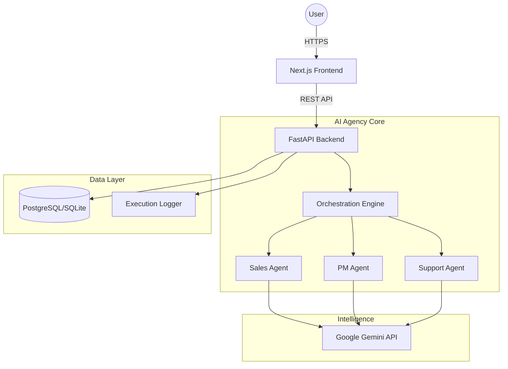

# System Architecture: Digital FTE Factory

## Overview
The system follows a modern microservices-adjacent architecture, optimized for AI-driven workflows.

## Key Architectural Decisions
1.  **Frontend (Phase-03):** React-based Next.js with `standalone` Docker optimization for sub-second cold starts on Cloud Run.
2.  **Backend (Phase-04):** FastAPI with Pydantic for strict type safety and auto-generated OpenAPI documentation.
3.  **Agentic Design:** Each agent is an independent class with its own toolset (CRM tools, Knowledge tools, etc.), coordinated by a central Workflow Manager.
4.  **Security:** JWT-based authentication and protected API routes.
